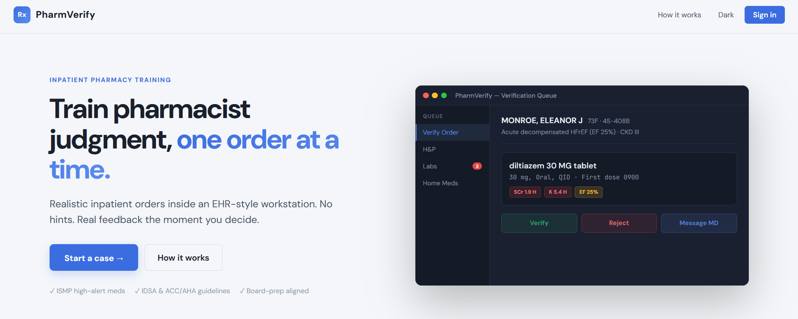
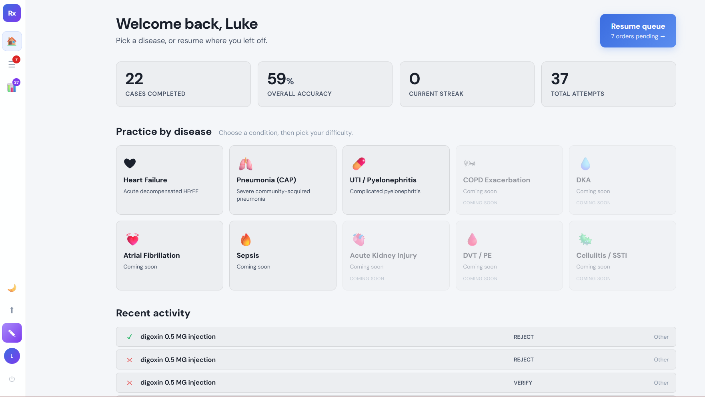
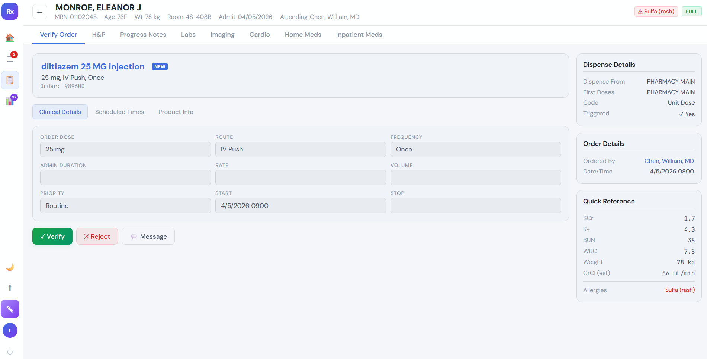
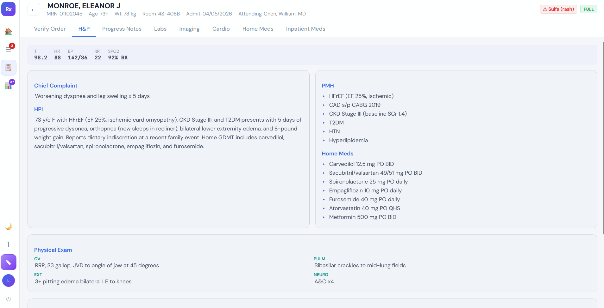
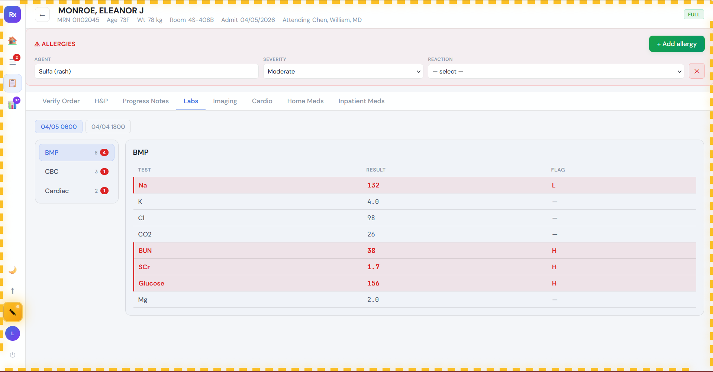

# PharmVerify

**Practice the decision that matters most: verify, reject, or clarify.**

PharmVerify is an inpatient order verification trainer for pharmacy students, residents, and pharmacists preparing for the floor or for boards. It puts you inside a realistic EHR-style workstation and asks the question every inpatient pharmacist answers a hundred times a shift: *should this order go through?*

---

## A look inside

| Home dashboard | Verify an order |
| --- | --- |
|  |  |

| H&P chart view | Preceptor edit mode |
| --- | --- |
|  |  |

---

## Why it exists

Most pharmacy practice tools are flashcards. Flashcards are great for facts, but they don't train **judgment**. On the floor you don't get a multiple-choice prompt — you get a chart, a med list, a set of labs, and an order that may or may not belong to that patient. PharmVerify recreates that moment.

- No hints. No alert bars giving away the answer.
- Real chart context: H&P, progress notes, labs (with abnormal flags), home meds, inpatient meds, imaging, cardio.
- Three actions, just like real life: **Verify**, **Reject** (with a reason), or **Message the prescriber**.
- Feedback only *after* you decide — so you actually have to think first.

---

## Who it's for

- **Pharmacy students** on IPPE/APPE rotations who want reps before they're standing next to a preceptor.
- **PGY-1 residents** building speed and pattern recognition for verification shifts.
- **NAPLEX / BCPS candidates** who want board-style clinical reasoning instead of dry recall.
- **Preceptors** looking for a low-stakes way to assign realistic verification practice.

---

## How a case works

1. **Open the queue.** You see a list of pending orders, each tied to a patient.
2. **Click an order.** The full chart opens — H&P, labs, notes, meds, allergies. Dig around like you would in Epic or Cerner.
3. **Make a call:**
   - **Verify** if the order is appropriate.
   - **Reject** and pick the reason(s) why from a multiple-choice list.
   - **Message MD** if it needs clarification (missing duration, unclear indication, etc.).
4. **Get feedback.** A teaching panel explains the clinical reasoning, the relevant guideline, and what the optimal action would have been. This is where the learning happens.

---

## Difficulty levels

- **Easy** — every order has something wrong. Your job is to find it.
- **Medium** — a mix of correct and incorrect orders. You have to actually decide, not just hunt.
- **Hard** — clinically nuanced cases where there isn't always one right answer. Graded on a spectrum: optimal / acceptable / suboptimal / incorrect.

---

## Disease-based practice

Pick a disease state and drill cases focused on it. Currently built out:

- **Heart Failure** — ADHF, GDMT continuation, contraindicated agents, cardiorenal management
- **Pneumonia (CAP)** — empiric coverage, severity-based escalation, atypical coverage, steroid use
- **UTI / Pyelonephritis** — empiric IV vs oral, allergy navigation, agents that don't work for upper-tract disease

Coming soon: COPD exacerbation, DKA, atrial fibrillation, sepsis, AKI, VTE, cellulitis.

---

## What you'll practice

- ISMP high-alert medications (insulin, anticoagulants, methotrexate, opioids, KCl)
- Renal and hepatic dose adjustments
- Allergy cross-reactivity (penicillin, sulfa, SJS history)
- Drug-disease contraindications (non-DHP CCBs in HFrEF, NSAIDs in ADHF, etc.)
- Frequency, route, and duration errors
- Guideline-driven empiric therapy (IDSA, ACC/AHA, ADA)
- When to clarify vs. when to reject outright

---

## A note on philosophy

We took the alert bars and the hint banners *out* on purpose. Real EHRs are full of pop-ups, but the cognitive work — looking at the labs, looking at the home meds, reading the note — is what makes a pharmacist. PharmVerify wants you to do that work every time. The teaching comes after, when it can actually stick.

---

## For preceptors: edit mode

Preceptors can flip the whole workstation into **edit mode** from the sidebar (the gold pencil button). When it's on, the app gets a marching-ants gold border so you always know you're authoring, not practicing. Then almost every field in the chart becomes click-to-edit:

- **Patient banner** — name, MRN, age, weight, room, admit date, attending
- **Allergies** — add/remove agents, pick severity (Mild → Life-threatening), choose from the top 10 allergic reactions in a dropdown
- **H&P** — chief complaint, HPI, PMH, home meds, vitals (each label/value), every physical exam section, assessment, plan
- **Labs** — edit any value; abnormal flags (H/L) are recomputed automatically against adult reference ranges
- **Progress notes, home meds, inpatient meds** — edit in place, add or remove rows
- **Imaging, cardio** — edit findings and impressions
- **The order itself** — drug, dose, route, frequency, indication, ordering provider, timestamp
- **Teaching panel (preceptor only)** — toggle the correct action (verify / reject / message), edit the explanation, and add/edit/remove reject reasons with a per-reason correct/incorrect toggle

All edits persist locally so you can build or tweak a case without leaving the app.

---

## Polish

- Modern entry transitions on the home and landing pages (fly, fade, scale, staggered reveals)
- Scroll-triggered reveal animations on the landing page (respects `prefers-reduced-motion`)
- Smooth slide-down difficulty picker when you choose a disease tile, with no layout shift
- **Randomized reject reasons** — the reject modal shuffles reason order every time it opens, so learners can't pattern-match on "the correct ones are always on top"

---

## Quality & testing

- **93+ unit tests** across critical business logic (clinical utilities, parser, stores, components, localStorage edge cases, data integrity of demo and disease cases)
- **Playwright E2E tests** covering the core verify → feedback loop
- **CI workflow** runs unit tests and E2E on every push
- Coverage reports generated for [utils/clinical.js](src/lib/utils/clinical.js) and [utils/parser.js](src/lib/utils/parser.js)
- Recent stability fix: resolved a null-reference crash in the order pipeline

---

## Privacy

All cases, attempts, and progress are stored **locally on your device**. Nothing is uploaded. No accounts on a server, no PHI, no tracking.

---

## Getting started

Visit the app, create a local profile (just your name and email — stays on your device), pick a disease and difficulty, and start working through cases. The first time you log in there's a short walkthrough orienting you to the workstation.

---

## Feedback

Found a case where the teaching is off, the labs don't make sense, or the right answer feels wrong? That's exactly the kind of feedback that makes this tool better. Open an issue with the case ID and what you'd change.
